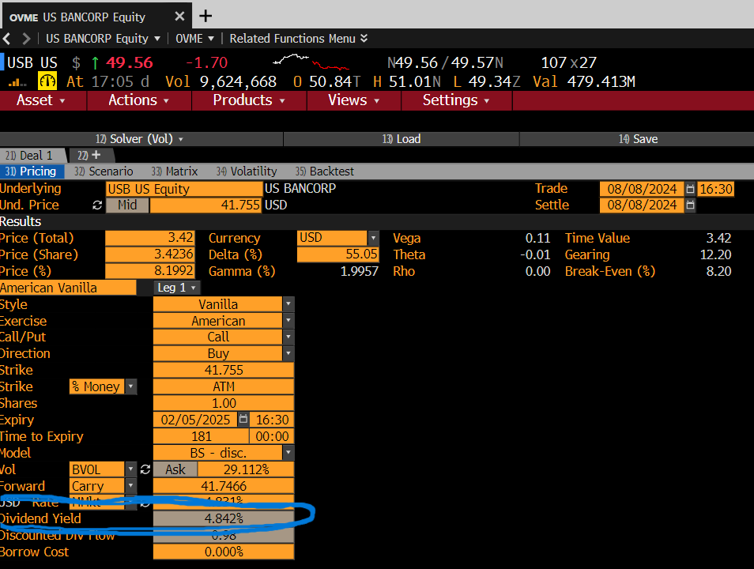

top=1cm,
    bottom=0.7cm,
    left=0.8in,
    right=0.8in,
    includeheadfoot,
    heightrounded
]{geometry}

 

  

C[1]{>{}p{#1}}

americanblue{RGB}{0,71,171}
headerblue{RGB}{0,157,224}  
lightblue{RGB}{217,241,255} 

{americanblue{UBS AG \$4,593,000 Trigger Callable Contingent Yield Notes\$0.05cm]
Linked to the common stock of U.S. Bancorp due August 13, 2026}

0.2cm
 -Valuation report by Yadvesh, Krish and Mayank}

1ex

# (I) Introduction

This report aims to value the UBS AG Trigger Callable Contingent Yield Notes, which are linked to the common stock of U.S. Bancorp due on August 13, 2026. According to our valuation methods, we estimate the value of the note to be **\$973.42**.

0.5cm

**1) Below are the Key Dates of the Note:**

1.3  
{|C{0.45}|C{0.45}|}  

2{|c|}{headerbluewhite**Key Dates**} \\

**Trade Date (T0**) & August 8, 2024 \\

**Settlement Date (T1**) & August 13, 2024 \\

lightblue**Observation Dates** & Quarterly (first available after 6 months) \\

**Final Valuation Date (T2**) & August 10, 2026 \\

lightblue**Maturity Date (T3**) & August 13, 2026 \\

0.5cm

**2) Below are the Note Offering:**

{width=1.2,center}  
1.3
{|C{3.5cm}|C{2.5cm}|C{3cm}|C{2.5cm}|C{3cm}|C{3cm}|C{3cm}|C{3cm}|}

8{|c|}{headerbluewhite**Note Offering**} \\

lightblue**Underlying Asset** & lightblue**Bloomberg Ticker** & lightblue**Contingent Coupon Rate** & lightblue**Initial Level** & lightblue**Coupon Barrier** & lightblue**Downside Threshold** & lightblue**Share Delivery Amount** & lightblue**CUSIP / ISIN** \\

Common stock of U.S. Bancorp & USB & 10.25\

0.5cm

**3) Below are the Observation Dates and Coupon Payment Dates:**

1.3  
{|C{0.45}|C{0.45}|}

2{|c|}{headerbluewhite**Observation Dates and Coupon Dates**} \\

lightblue**Observation Dates** & lightblue**Coupon Dates** \\

November 8, 2024 & November 13, 2024 \\

February 10, 2025 & February 13, 2025 \\

lightblueMay 8, 2025 & May 13, 2025 \\

August 8, 2025 & August 13, 2025 \\

lightblueNovember 10, 2025 & November 13, 2025 \\

February 9, 2026 & February 12, 2026 \\

lightblueMay 8, 2026 & May 13, 2026 \\

Final Valuation Date & Maturity Date \\

0.5cm

**4) Some important characteristics of the note are:**

- The note has just one underlying asset i.e. the common stock of U.S. Bancorp (USB). 
- On any observation date (beginning after 6 months) other than the final valuation date, UBS may elect to call the Notes and will pay a cash payment per Note equal to the principal amount plus any contingent coupon otherwise due on the call settlement date, and no further payments or deliveries will be made on the Notes
- A contingent coupon is payable on a coupon payment date if the closing level of the underlying asset is equal to or greater than the coupon barrier(60\
- Contingent Repayment of Principal Amount at Maturity with Potential for Full Downside Market Exposure:
	
	- UBS will pay a cash payment equal to Principal Amount of(\$1,000) if UBS does not elect to call the Notes and the final level is equal to or greater than the downside 			threshold (60\
	- UBS will deliver a number of shares of the underlying asset (with cash paid in lieu of any fractional share), equal to _Share Delivery Amount*_
	

{ {*Note: Share Delivery Amount (per Note)\\
A number of shares of the underlying asset equal to the quotient of (i) the principal amount divided by (ii) the initial level, rounded to the nearest ten thousandth of one share, as specified on the cover hereof. Any fractional share included in the share delivery amount will be paid in cash at an amount equal to the product of the fractional share and the final level. For the avoidance of doubt, if the share delivery amount is less than 1.0000, at maturity you will receive an amount in cash per Note, if anything, equal to the product of the share delivery amount and the final level.}}

0.5cm

**5) Payoff at Maturity of the Note is:**
[H]
    
    
    Payoff at Maturity
    fig:yourlabel

  

# (II) Input Data Characteristics:

- **Risk-Free Rate (OIS):**
	
	-  OIS rates are based on overnight lending rates which have very low credit risk. OIS closely tracks the central bank's target rates and the OIS market is typically very liquid so we use OIS as a proxy from risk-free rates. However, OIS rate is based on very short-term rates, which may not fully capture the term structure of interest rates for longer-dated instruments.
	- For our Project we had to Linearly Interpolate the Discount Factors to get the continuously compounded Risk-free rate r(0,T1) for Settlement Date(T1) and  r(0, T3) for Maturity Date(T3) respectively. The calculated values were r(0,T1) = **5.383127\
	- After Linear interpolationand rate calculation we had to figure out the forward rate F(T1, T3) from Settlement Date(T1) to Maturity Date(T3) which would be used for discounting. Also, r(0,T2) will be used for probability measure q calculation.
	- The final Values for  r(0,T2)  for probability measure q calculation is r(0,T2) = **3.720811\
	

[H]
    
    
    USD OIS at 08/08/2024
    fig:yourlabel

- **Implied Volatility Matrix:**
	
	-  The Implied Volatility Matrix is used extensively in options pricing to gauge the volatility across different strike prices (moneyness) and maturities. It provides a real-time snapshot of volatility expectations. However, if the market is illiquid, the matrix may not reflect accurate volatility estimates, especially for less popular strikes or distant expirations.
	- For our Project since the Note we are valuing approximately matures in 2 Years so we used 24M Volatilites from the Volatility-Matrix at different Moneyness from 60 till 100 to gauge the sensitivity of Note Valuation on different volatilities.
	

[H]
    
    
    Implied Volatility Matrix for USB at 08/08/2024
    fig:yourlabel

- **Continuous Dividend Yield:**
	
	-  Including the dividend yield allows for a more accurate representation of the underlying asset’s price trajectory over time. However, for stocks with fluctuating dividend payments, using a fixed yield can misrepresent expected returns.
	- For our Project we used a continuous dividend yield of D = **4.842\
	

[H]
    
    
    Dividend Yield for USB at 08/08/2024
    fig:yourlabel

# (III) Methodology

We have conducted the valuation of the note using a 9999-step binomial tree, implementing three different methodologies within this framework: the Cox, Ross, \& Rubinstein (CRR) method, Rendleman and Bartter (RB) method and the Leisen-Reimer (LR) method. As the note includes features like Issuer Callable and Contingent coupons at discrete observation dates, this introduces path dependency in the note valuation and if we employ the traditional Cox, Ross, \& Rubinstein (CRR) and Rendleman and Bartter (RB) Binomial Lattices, this can introduce non-linearity errors into the valuation. To account for this we have finally chosen Leisen-Reimer (LR) Binomial lattice that diminishes these non-linearity errors along with this we also employed 9999 time-steps to ensure that we have a sufficiently large framework which minimizes other errors in valuation and the final Note value smoothly converges with least errors.\\\\
The Binomial lattice methods used follow the below equations to calculate the probability measure q:

    - Cox, Ross and Rubinstein, 1979, CRR $$ $(u = e^{ t}, d = 1/u)$
    
    - Rendleman and Bartter, 1979, RB $$ $(u = ((r -  - 0.5^2) t +  t), \\ d = ((r -  - 0.5^2) t -  t))$
    
    - Leisen and Reimer, 1996, LR $$
    
        - $q = h(d_2)$
        - $u = e^{(r-) t}q^*{q}$
        - $d = e^{(r-) t - qu}{1-q}$
    

Where:\$0.5cm]
$d_{1,2} = (S/K) + (r -   1{2^2)(T)}{(T)}$ \\

$h(x) = 1{2} + sign(x)1{4 - 1{4}\{-(x{N+1{3}})^2(N+1{6})\}}$ \\

$q^* = h(d_1)$\\\\

Finally, in real-world financial markets, implied volatility is not constant across different strike prices or moneyness levels. Instead, it often exhibits a pattern known as the volatility smile or volatility skew, where implied volatility varies with moneyness.  Relying on a single implied volatility (e.g., at-the-money volatility) could lead to mispricing, especially for options with payoffs that are sensitive to the tails of the asset price distribution. Averaging valuations across multiple moneyness levels allows us to account for the entire implied volatility surface, leading to a more accurate and robust valuation of the note. So to incorporate different moneyness levels we took the average of Note Values at each moneyness level from 65 till 100 at 5 step intervals to get the final Note Value.

# (IV) Valuation Model for the Trigger Callable Contingent Coupon Note

We have developed a valuation model for the Trigger Callable Contingent Coupon Note using three binomial lattices explained in the subsequest sections

## Estimating Parameters (\( u \), \( d \), and \( q \)) to Construct the Binomial Tree

Assuming there is no arbitrage in the risk-neutral world, we estimate the value of the instrument using risk-neutral probabilities discounted at the risk-free rate F(T1,T3). We employ three different binomial lattice methods to determine the size of the up (\( u \)) and down (\( d \)) movements, and the risk-neutral probability (\( q \)) which uses risk-free rate r(0,T2) :

    - **Cox, Ross, and Rubinstein (CRR) Model**:
    $
    u = e^{  t},  d = e^{-  t} = 1{u}
    $
    $
    q = e^{(r_1 - )  t - d}{u - d}
    $
    
    - **Rendleman and Bartter (RB) Model**:
    $
    u = 
    $
    $
    d = 
    $
    $
    q = e^{(r_1 - )  t - d}{u - d}
    $
    
    - **Leisen and Reimer (LR) Model**:
    
        - Calculate \( d_1 \) and \( d_2 \):
        $
        d_{1,2} = (S_0{B) + (r_1 -   1{2} ^2) (T_2 - T_0)}{ T_2 - T_0}
        $
        - Compute the function \( h(x) \):
        $
        h(x) = 1{2} + sign(x) 1{4 - 1{4} (-(x{N + 1{3}})^2 (N + 1{6}))}
        $
        - Determine \( q \), \( q^* \), \( u \), and \( d \):
        $
        q = h(d_2),  q^* = h(d_1)
        $
        $
        u = e^{(r_1 - )  t} q^*{q},  d = e^{(r_1 - )  t - u q}{1 - q}
        $
    

 Where:

    - \(  \) is the implied volatility.
    - \( r_1 \) is the continuously compounded risk-free rate r(0,T2).
    - \(  \) is the continuous dividend yield.
    - \(  t = T_2 - T_0{N} \) is the time step size.
    - \( S_0 \) is the initial stock price.
    - \( B \) is the barrier level.
    - \( N \) is the number of time steps.
    - \( T_2 - T_0 \) is the time to maturity.

### Incorporating Continuous Dividend Yield

In our model, we incorporate the continuous dividend yield \(  \) directly into the stock price dynamics and the risk-neutral probabilities. This reflects the continuous payment of dividends and affects both the expected return and the risk-neutral measure.

### Assumptions

    - In the risk-neutral world, the expected return on the stock is adjusted for dividends:
    $
    E[S_t] = S_0 e^{(r1 - ) t}
    $
    - The variance of returns over a period \( t \) is \( ^2 t \).
    - The underlying asset's returns are normally distributed over a period \( t \) with mean \( (r1 -  - 1{2} ^2) t \) and variance \( ^2 t \):
    $
    (S_t{S_0})  N((r1 -  - 1{2} ^2) t, ^2 t)
    $

## Constructing the Stock Price Tree

We construct the stock price tree with \( N \) time steps over the period from the trade date to the final valuation date, which is \( T_2 - T_0 \) years. Each node in the tree represents a possible price of the underlying asset at a particular time step.

Let:

    - \( i \) denote each time step, ranging from \( 0 \) to \( N \).
    - \( j \) denote the number of up movements at each time step \( i \), ranging from \( 0 \) to \( i\).

The stock price at each node \( S_{i,j} \) is calculated using the formula:

$
S_{i,j} = S_0 u^j d^{i - j}
$

### Examples

    - **Initial Node** (\( i = 0 \)):
    $
    S_{0,0} = S_0
    $
    - **After One Time Step** (\( i = 1 \)):
    
        - If the price moves up (\( j = 1 \)):
        $
        S_{1,1} = S_0 u
        $
        - If the price moves down (\( j = 0 \)):
        $
        S_{1,0} = S_0 d
        $
    
    - **At Node (\( i, j \))**:
    $
    S_{i,j} = S_0 u^j d^{i - j}
    $

## Constructing the Valuation Tree Using Backward Induction

After constructing the stock price tree, we build a valuation tree to determine the value of the note at each node. We start by specifying the note's value at maturity based on its payoff structure.

### Payoff at Maturity

At maturity (\( i = N \)):

    - **If \( S_{N,j**  B \)}:

    The investor receives the principal amount plus the final coupon payment:
    $
    V_{N,j} = Principal Amount + Coupon Payment
    $

    - **If \( S_{N,j** < B \)}:

    The investor receives the share delivery amount times the stock price:
    $
    V_{N,j} = Share Delivery Amount  S_{N,j}
    $

### Backward Induction

Using backward induction, we compute the value at each preceding node:

$
V_{i,j} = e^{-r_2  t} 
$

Where:

    - \( V_{i,j} \) is the value of the note at node \( (i, j) \).
    - \( r_2 \) is the risk-free rate.
    - \(  t \) is the time step size.
    - \( q \) is the risk-neutral probability of an up move.

At each observation step \( i \) (corresponding to observation dates), we adjust the valuation based on the note's features.

### Coupon and Trigger Callable Adjustments

For each node at observation steps:

    - **If \( S_{i,j**  B \):}
    
        - **Coupon Payment Adjustment:**
        $
        V_{i,j} = e^{-r_2  t}  + Coupon Payment
        $
    
    - **If \( S_{i,j** < B \):}
    
        - **No Coupon Payment:**
        $
        V_{i,j} = e^{-r_2  t} 
        $
    

Additionally, if the note is callable (after the call protection period) at observation step \( i \):
-2ex

    - **Call Decision:**
    
        - Calculate the continuation value \( Cont_i \) as above.
        - Calculate the call payoff:
        $
        Call Payoff = Principal Amount + Coupon Payment
        $
        - The node value \( V_{i,j} \) is the minimum of the continuation value and the call payoff:
        $
        V_{i,j} = ( Call Payoff, V_{i,j} )
        $
    

-5ex
### Final Valuation

By recursively applying the backward induction process from maturity to the present, we compute the value at the initial node \( V_{0,0} \), which represents the estimated fair value of the note for a given implied volatility but as decribed above in methodology we will we averaging across the different moneyness implied vols. So the Final Value of the Note using Leisen-Reimer Binomial Lattice with 9999 time steps averaged out across different moneyness implied volatilities comes out to be  **\$973.42**.

-2ex

# (VI) Sensitivity Analysis and Possible Errors

## Sensitivity Analysis w.r.t. Moneyness

- Cox, Ross, and Rubinstein (CRR) Model:
The note's value increases as moneyness increases. The graph shows some fluctuations; it's less smooth compared to the RB and LR models. As moneyness increases (stock price rises relative to the strike or barrier levels), the likelihood of favorable outcomes for the investor increases, such as receiving coupons or higher redemption amounts. And the less smoothness says that for CRR lattice the Note Values are much more sensitive to the implied volatilities. And here the graph for N=9999 timesteps is much smoother compared to N=50 essentially stating that as time steps increases. The sensitivity of implied vols on Note Value reduces.
[htbp]
    
    [b]{0.48}
        
        
        CRR Note Value vs. Moneyness (N=50)
        fig:crr_n50
    
    
    [b]{0.48}
        
        
        CRR Note Value vs. Moneyness (N=9999)
        fig:crr_n9999
    
    CRR Note Values for Different Time Steps
    fig:crr_comparison

  

-  Rendleman and Bartter (RB) Model:
Just like CRR here as well the note's value increases as moneyness increases. The graph shows some fluctuations but it is more smooth compared to the RB but less smooth compared to LR model. The better smoothness is explained by a better choice of up and down movement quotients to get the probability measure q.  Just like CRR we can see that RB is also sensitive to implied vols but not as much as CRR although worse than LR. And here the graph for N=9999 timesteps is much smoother compared to N=50 essentially stating that as time steps increases. The sensitivity of implied vols on Note Value reduces.
[htbp]
    
    [b]{0.48}
        
        
        RB Note Value vs. Moneyness (N=50)
        fig:crr_n50
    
    
    [b]{0.48}
        
        
        RB Note Value vs. Moneyness (N=9999)
        fig:crr_n9999
    
    RB Note Values for Different Time Steps
    fig:crr_comparison

- Leisen and Reimer (LR) Model:
Finally for the LR model we can see that even for N=50 the curve is smooth stating that it is less sensitive compared to other Binomial lattiices chosen. Hence the better among the three to be chosen for Note valuation.
[htbp]
    
    [b]{0.48}
        
        
        LR Note Value vs. Moneyness (N=50)
        fig:crr_n50
    
    
    [b]{0.48}
        
        
        LR Note Value vs. Moneyness (N=9999)
        fig:crr_n9999
    
    LR Note Values for Different Time Steps
    fig:crr_comparison

## Error Profiles

- Cox, Ross, and Rubinstein (CRR) Model:
For CRR we can clearly see that there are non-linearity errors as the Note value fluctuates a lot for smaller time steps N and as we incraese the N steps the errors reduce. This happens because as the number of time-steps increases the discrete barriers move halfway between Binomial tree nodes thus effectively reducing the non-linearity errors.
[H]
    
    
    The CRR Note Value Profile for Different Time Steps (N)
    fig:yourlabel

-  Rendleman and Bartter (RB) Model:
Similar to CRR above here as well we can clearly see that there are non-linearity errors as the Note value fluctuates a lot for smaller time steps N and as we incraese the N steps the errors reduce. The reasoning for this is also the same  as the number of time-steps increases the discrete barriers move halfway between Binomial tree nodes thus effectively reducing the non-linearity errors.
[H]
    
    
    The RB Note Value Profile for Different Time Steps (N)
    fig:yourlabel

- Leisen and Reimer (LR) Model:
For LR we can clearly see that there are no non-linearity errors  and the Note value very smoothly converges to a value around \$975 but there are still some errors even after 9999 timesteps because we cannot get rid of errors arising due to the call feature but it is mostly minimal error for Large timesteps. Hence we chose LR method as it resulted in the least errors..
[H]
    
    
    The LR Note Value Profile for Different Time Steps (N)
    fig:yourlabel

# (VII)Further Discussions
We found LR to be the best model for the binomial lattice but there is another model Broadie-Detemple (BD) which could have been chosen to value the Note. It is even better than LR in reducing Non-Linearity errors as it completely takes away the errors arrising at maturity nodes by assuming the Note to behave as a European option between N-1 and N timestep.